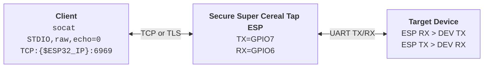

# Secure Super Cereal Tap ESP 💁‍♂️🔒🌉
*Half serial interface, half encryption layer, half TCP bridge*



A lightweight ESP32 firmware to bridge UART devices over TCP with optional TLS/mTLS support.

Motivation: Existing solutions lacked secure connectivity (or maybe I’m just bad at Google), and I was tired of physically disconnecting and relocating devices to debug or fix them. Also, it made a fun weekend project.

## Features ✨

- Bidirectional communication between TCP clients and UART devices
- UART speeds up to 5 Mbps with configurable pins (hardware UART limit on ESP32)
- Secure TLS mode with optional client certificate verification (mTLS)
- Fully configurable via `menuconfig`

## Requirements ✅

- [ESP-IDF](https://docs.espressif.com/projects/esp-idf/en/latest/esp32/get-started/) (v4.1.0 or later)
- Compatible with ESP32, ESP32-S3, ESP32-C3, ESP32-C6

## Setup 🛠️

### 1. Clone this repository

```bash
git clone https://github.com/yourusername/esp32-serial-tcp-bridge.git
cd esp32-serial-tcp-bridge
```

### 2. Set your target board

```bash
idf.py set-target esp32c6  # or esp32, esp32s3, esp32c3
```

### 3. Configure the project

```bash
idf.py menuconfig
```

**Important settings:**
- **Serial TCP Bridge Configuration → WiFi Configuration:** SSID, password, reconnect behavior
- **Serial TCP Bridge Configuration → UART Configuration:** Pins, port, baud rate
- **Serial TCP Bridge Configuration → Network Configuration:** TCP port
- **Serial TCP Bridge Configuration → Buffer and Timing Configuration:** Buffer sizes
- **Serial TCP Bridge Configuration → TLS Configuration:** Enable TLS, client verification

### 4. Configure the partition table

To use TLS, you must include a SPIFFS partition for storing certificates. You can either:

- Use the **Factory app, SPIFFS** predefined partition table in menuconfig (if available), or
- Create a custom partition table with a SPIFFS partition.

Default partition layout:

```csv
# Name,   Type, SubType, Offset,   Size,  Flags
nvs,       data, nvs,     0x9000,   24K,
phy_init,  data, phy,     0xF000,   4K,
factory,   app,  factory, 0x10000,  1M,
spiffs,    data, spiffs,  0x110000, 512K,
```

Verify partition configuration:

```bash
idf.py partition-table
```

The **spiffs** partition is critical for TLS certificates. Do not rename it.

## TLS Configuration 🔐

If using TLS, configure it in menuconfig:

```bash
idf.py menuconfig
```

Navigate to: **Serial TCP Bridge Configuration → TLS Configuration**

Important TLS settings:

- **Enable TLS security**: Enable TLS
- **Server certificate path**: Path in SPIFFS (default `/spiffs/server.crt`)
- **Server private key path**: Path in SPIFFS (default `/spiffs/server.key`)
- **Verify client certificates**: Enable for mTLS
- **CA certificate path**: Path in SPIFFS (default `/spiffs/ca.crt`)

These paths refer to the ESP32's SPIFFS filesystem after flashing.

## Certificate Generation for TLS 🪪

Place certificates in `<repo_root>/certs`. The build system automatically creates a SPIFFS image from this directory.

To generate certificates:

```bash
# Generate CA key and certificate
openssl req -x509 -newkey rsa:2048 -nodes -keyout ca.key -out ca.crt -days 365 -subj "/CN=Test-CA"

# Generate server key and CSR
openssl req -newkey rsa:2048 -nodes -keyout server.key -out server.csr -subj "/CN=ESP32-Server"

# Sign server certificate
openssl x509 -req -in server.csr -CA ca.crt -CAkey ca.key -CAcreateserial -out server.crt -days 365

# Generate client key and CSR (for mTLS)
openssl req -newkey rsa:2048 -nodes -keyout client.key -out client.csr -subj "/CN=Client"

# Sign client certificate (for mTLS)
openssl x509 -req -in client.csr -CA ca.crt -CAkey ca.key -CAcreateserial -out client.crt -days 365
```
Place the files in `<repo_root>/certs/`:

- `certs/server.crt` - Server certificate
- `certs/server.key` - Server private key
- `certs/ca.crt` - CA certificate (only for mTLS)

**Note:** Certificate paths in `menuconfig` are ESP32 SPIFFS partition paths (not local filesystem). Don't change them unless you know what you're doing.

## Build, flash, monitor 🏗️💥🧐

```bash
idf.py build flash monitor
```

- `build`: Compiles firmware and creates SPIFFS image
- `flash`: Uploads firmware and filesystem to ESP32
- `monitor`: Opens serial console to ESP32

## Default Configuration 💡

- **WiFi**: Connects to configured SSID with auto-reconnect
- **UART**:
  - Port: UART1
  - Pins: TX=7, RX=6
  - Baud Rate: 1.5 Mbps
  - Buffer Size: 4 KB
- **TCP**: Port 6969 (plain TCP by default)
- **Data Transfer**: 2 KB buffer for efficient communication

## Connecting to the Bridge 🔌

Use `socat` for terminal access. Raw mode (`raw,echo=0`) prevents local echo and ensures proper character handling.

### With mutual authentication (secure, mTLS)

When using mTLS, the server certificate must match the DNS name used by the client due to Server Name Indication (SNI) checks during the TLS handshake. Connecting by IP address will fail if the certificate was issued for a hostname.

```bash
socat STDIO,raw,echo=0,escape=0x1d OPENSSL:[ESP32_DNS]:6969,cert=client.crt,key=client.key,cafile=ca.crt,verify=1
```

*If no DNS entry exists for your ESP32, add to hosts file: 192.168.1.x ESP32-Server*

### TLS connection (encryped in transit, but still wide open to anyone on your network)

```bash
socat STDIO,raw,echo=0,escape=0x1d OPENSSL:[ESP32_IP]:6969,verify=0
```

### Plain TCP (completely insecure, wide open)

```bash
socat STDIO,raw,echo=0,escape=0x1d TCP:[ESP32_IP]:6969
```


