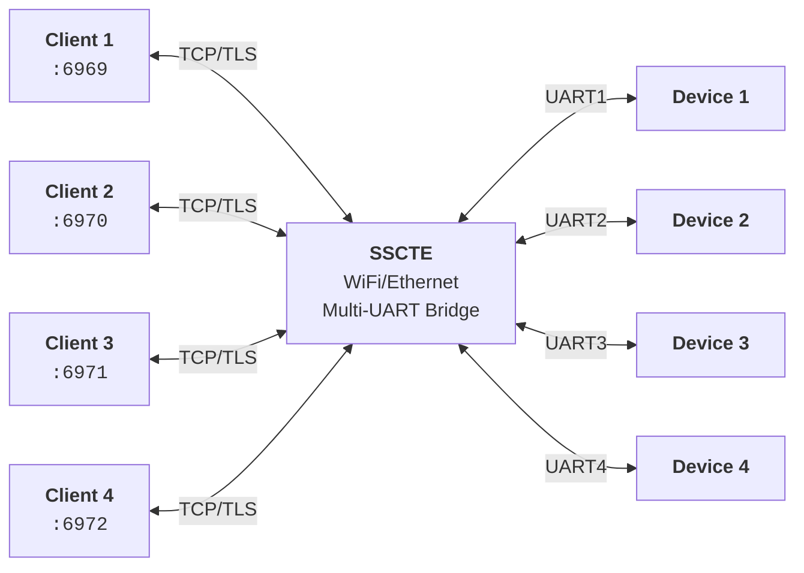

# Secure Super Cereal Tap ESP 💁‍♂️🔒🌉
*Half serial interface, half encryption layer, half TCP bridge*


```mermaid
flowchart LR
  Client1["<b>Client 1</b><br/><code>:6969</code>"] <-->|TCP/TLS| ESP32
  Client2["<b>Client 2</b><br/><code>:6970</code>"] <-->|TCP/TLS| ESP32
  Client3["<b>Client 3</b><br/><code>:6971</code>"] <-->|TCP/TLS| ESP32
  Client4["<b>Client 4</b><br/><code>:6972</code>"] <-->|TCP/TLS| ESP32
  ESP32["<b>SSCTE</b><br/>WiFi/Ethernet<br/>Multi-UART Bridge"] <-->|UART1| Device1["<b>Device 1</b>"]
  ESP32 <-->|UART2| Device2["<b>Device 2</b>"]
  ESP32 <-->|UART3| Device3["<b>Device 3</b>"]
  ESP32 <-->|UART4| Device4["<b>Device 4</b>"]
```

A lightweight ESP32 firmware that bridges **multiple UART devices** over TCP with optional TLS/mTLS support. Access up to 4 serial devices simultaneously over WiFi or Ethernet.

**Motivation:** Existing solutions lacked secure connectivity (or maybe I'm just bad at Google), and I was tired of physically disconnecting and relocating devices to debug or fix them. Also, it made a fun weekend project.

## Features ✨

- **Multi-UART support**: Up to 4 simultaneous UART-TCP bridges (1-4 depending on chip)
- **Dual network backend**: WiFi or Ethernet (compile-time selection)
- **Bidirectional data transfer**: Full-duplex communication between TCP clients and UART devices
- **High-speed UART**: Up to 5 Mbps with configurable pins per UART
- **Security options**: Plain TCP, TLS, or mutual TLS (mTLS) with client certificate verification
- **Independent configuration**: Each UART bridge has its own pins, baud rate, and TCP port
- **Fully configurable**: All settings via `idf.py menuconfig`

## Requirements ✅

- [ESP-IDF](https://docs.espressif.com/projects/esp-idf/en/latest/esp32/get-started/) v4.1.0 or later
- Compatible boards:
  - **ESP32** - WiFi, up to 3 UART bridges
  - **ESP32-S3** - WiFi, up to 3 UART bridges
  - **ESP32-C3** - WiFi, up to 2 UART bridges
  - **ESP32-C6** - WiFi, up to 3 UART bridges
  - **ESP32-P4** - Ethernet (internal MAC), up to 4 UART bridges

## Setup 🛠️

### 1. Clone this repository

```bash
git clone https://github.com/yourusername/SSCTE.git
cd SSCTE
```

### 2. Set your target board

```bash
idf.py set-target esp32p4  # or esp32, esp32s3, esp32c3, esp32c6
```

### 3. Configure the project

```bash
idf.py menuconfig
```

Navigate to: **Serial TCP Bridge Configuration**

#### Network Interface

**Serial TCP Bridge Configuration → Network Interface**

Choose your network backend:
- **WiFi** - All ESP32 variants (default)
- **Ethernet** - ESP32-P4 and boards with Ethernet MAC

**WiFi Configuration** (if WiFi selected):
- SSID and password
- Connection retry settings
- Reconnect delays

**Ethernet Configuration** (if Ethernet selected):
- PHY model (IP101, RTL8201, LAN87xx, DP83848, KSZ80xx)
- PHY address and reset GPIO
- RMII pin configuration (defaults work for ESP32-P4-Module-DEV-KIT)

#### UART Bridges

**Serial TCP Bridge Configuration → UART Configuration**

- **Number of UART bridges**: 1-4 (depending on chip)
- **UART1-4 Configuration**: Individual settings for each bridge
  - TX/RX GPIO pins
  - Baud rate
  - TCP port number

**Default UART configuration:**
- UART1: TX=GPIO7, RX=GPIO6, Port=6969
- UART2: TX=GPIO10, RX=GPIO9, Port=6970
- UART3: TX=GPIO17, RX=GPIO16, Port=6971
- UART4: TX=GPIO19, RX=GPIO18, Port=6972

**Note:** UART0 is reserved for console/debug output.

#### Optional: TLS Configuration

**Serial TCP Bridge Configuration → TLS Configuration**

- Enable TLS security
- Server certificate/key paths in SPIFFS
- Optional client certificate verification (mTLS)

**Important:** Enabling TLS requires SPIFFS partition (see below).

### 4. Configure the partition table

To use TLS, you must include a SPIFFS partition for storing certificates. You can either:

- Use the **Factory app, SPIFFS** predefined partition table in menuconfig (if available), or
- Create a custom partition table with a SPIFFS partition.

Default partition layout:

```csv
# Name,   Type, SubType, Offset,   Size,  Flags
nvs,       data, nvs,     0x9000,   24K,
phy_init,  data, phy,     0xF000,   4K,
factory,   app,  factory, 0x10000,  1M,
spiffs,    data, spiffs,  0x110000, 512K,
```

Verify partition configuration:

```bash
idf.py partition-table
```

The **spiffs** partition is critical for TLS certificates. Do not rename it.

## TLS Configuration 🔐

If using TLS, configure it in menuconfig:

```bash
idf.py menuconfig
```

Navigate to: **Component configuration → Serial TCP Bridge Configuration → TLS Configuration**

Important TLS settings:

- **Enable TLS security**: Enable TLS
- **Server certificate path**: Path in SPIFFS (default `/spiffs/server.crt`)
- **Server private key path**: Path in SPIFFS (default `/spiffs/server.key`)
- **Verify client certificates**: Enable for mTLS
- **CA certificate path**: Path in SPIFFS (default `/spiffs/ca.crt`)

These paths refer to the ESP32's SPIFFS filesystem after flashing.

## Certificate Generation for TLS 🪪

Place certificates in `<repo_root>/certs`. The build system automatically creates a SPIFFS image from this directory.

To generate certificates:

```bash
# Generate CA key and certificate using EC
openssl ecparam -name prime256v1 -genkey -noout -out ca.key
openssl req -new -x509 -key ca.key -out ca.crt -days 365 -subj "/CN=Test-CA"

# Generate server key and CSR using EC
openssl ecparam -name prime256v1 -genkey -noout -out server.key
openssl req -new -key server.key -out server.csr -subj "/CN=ESP32-Server"

# Sign server certificate (same as before)
openssl x509 -req -in server.csr -CA ca.crt -CAkey ca.key -CAcreateserial -out server.crt -days 365

# Generate client key and CSR using EC (for mTLS)
openssl ecparam -name prime256v1 -genkey -noout -out client.key
openssl req -new -key client.key -out client.csr -subj "/CN=Client"

# Sign client certificate (same as before)
openssl x509 -req -in client.csr -CA ca.crt -CAkey ca.key -CAcreateserial -out client.crt -days 365
```
Place the files in `<repo_root>/certs/`:

- `certs/server.crt` - Server certificate
- `certs/server.key` - Server private key
- `certs/ca.crt` - CA certificate (only for mTLS)

**Note:** Certificate paths in `menuconfig` are ESP32 SPIFFS partition paths (not local filesystem). Don't change them unless you know what you're doing.

## Build, flash, monitor 🏗️💥🧐

```bash
idf.py build flash monitor
```

- `build`: Compiles firmware and creates SPIFFS image
- `flash`: Uploads firmware and filesystem to ESP32
- `monitor`: Opens serial console to ESP32

## Default Configuration 💡

**Network:**
- **WiFi** (default): Connects to configured SSID with auto-reconnect
- **Ethernet** (ESP32-P4): DHCP client, link auto-detection

**UART Bridges:**
- **UART1**: TX=GPIO7, RX=GPIO6, 1.5 Mbps → TCP port 6969
- **UART2**: TX=GPIO10, RX=GPIO9, 1.5 Mbps → TCP port 6970
- **UART3**: TX=GPIO17, RX=GPIO16, 1.5 Mbps → TCP port 6971
- **UART4**: TX=GPIO19, RX=GPIO18, 1.5 Mbps → TCP port 6972

**Buffers:**
- UART driver: 4 KB per bridge
- Data transfer: 2 KB per direction per bridge

**Security:** Plain TCP (TLS disabled by default)

## Connecting to the Bridge 🔌

Use `socat` for terminal access. Raw mode (`raw,echo=0`) prevents local echo and ensures proper character handling.

### Connecting to Multiple UARTs

Each UART bridge listens on its own TCP port:

```bash
# Connect to Device 1 on UART1
socat STDIO,raw,echo=0,escape=0x1d TCP:[ESP32_IP]:6969

# Connect to Device 2 on UART2 (in another terminal)
socat STDIO,raw,echo=0,escape=0x1d TCP:[ESP32_IP]:6970

# Connect to Device 3 on UART3 (in another terminal)
socat STDIO,raw,echo=0,escape=0x1d TCP:[ESP32_IP]:6971

# Connect to Device 4 on UART4 (in another terminal)
socat STDIO,raw,echo=0,escape=0x1d TCP:[ESP32_IP]:6972
```

**Note:** Press `Ctrl-]` to exit socat (escape character 0x1d).

### TLS/mTLS Connections

When using TLS, all bridges share the same security configuration.

**With mutual authentication (secure, mTLS):**

```bash
socat STDIO,raw,echo=0,escape=0x1d OPENSSL:[ESP32_DNS]:6969,cert=client.crt,key=client.key,cafile=ca.crt,verify=1
```

⚠️ **Important:** When using mTLS, you must connect via DNS hostname (not IP) due to SNI requirements. Add to `/etc/hosts` if needed:
```
192.168.1.241  ESP32-Server
```

**TLS without client verification (encrypted but not authenticated):**

```bash
socat STDIO,raw,echo=0,escape=0x1d OPENSSL:[ESP32_IP]:6969,verify=0
```

**Plain TCP (unencrypted, no authentication):**

```bash
socat STDIO,raw,echo=0,escape=0x1d TCP:[ESP32_IP]:6969
```

## Architecture Overview 🏗️

```
┌─────────────────────────────────────────────────────┐
│                  serial_tcp_bridge.c                │
│              (Main application loop)                │
└────────┬────────────────────────────────────┬───────┘
         │                                    │
         ▼                                    ▼
┌────────────────────┐              ┌─────────────────┐
│  network_manager   │              │  uart_manager   │
│  (Abstraction)     │              │  (Multi-UART)   │
└─────┬──────────────┘              └────────┬────────┘
      │                                      │
      ▼                                      ▼
┌─────────────┐                    ┌──────────────────┐
│ WiFi/Eth    │                    │  tcp_server      │
│ Backend     │◄───────────────────┤  (TLS/mTLS)      │
└─────────────┘                    └──────────────────┘
```

**Components:**
- **network_manager**: Unified network API (WiFi/Ethernet selection)
- **uart_manager**: Multi-UART configuration and data handling
- **tcp_server**: TCP/TLS server per bridge, optional mTLS
- **network_wifi/ethernet**: Backend implementations

## Performance Characteristics ⚡

- **UART Speed**: Up to 5 Mbps (hardware limit)
- **Latency**: ~10ms loop iteration (configurable)
- **Throughput**: Limited by network and UART buffer sizes
- **Concurrent Connections**: 1 TCP client per UART bridge
- **Memory**: ~30 KB per bridge (buffers + state)

## Troubleshooting 🔧

**Connection Issues:**
- Verify network connectivity (ping ESP32 IP)
- Check firewall rules for TCP ports
- Ensure only one client connects per bridge at a time

**UART Issues:**
- Confirm GPIO pins don't conflict with other peripherals
- Check target device baud rate matches configuration
- Verify RX/TX pins are swapped correctly (ESP TX → Device RX)

**TLS Issues:**
- Verify certificates are in `/certs` before build
- Check certificate validity dates
- For mTLS, ensure SNI hostname matches certificate CN
- Use IP address connection with `verify=0` for testing

**ESP32-P4 Ethernet:**
- Check Ethernet cable connection (link LED)
- Verify PHY type matches your board
- Default pins are for ESP32-P4-Module-DEV-KIT
- DHCP timeout is 30 seconds by default

## Contributing 🤝

Contributions welcome! Please:
1. Fork the repository
2. Create a feature branch
3. Test on actual hardware
4. Submit a pull request

## License 📄

This project is licensed under the Creative Commons Attribution-NonCommercial 4.0 International License.
See the [LICENSE](LICENSE) file for details.
